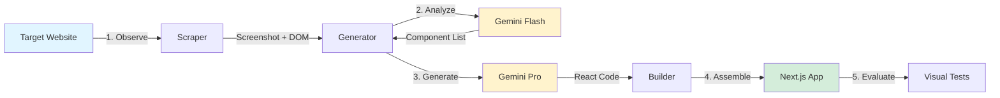
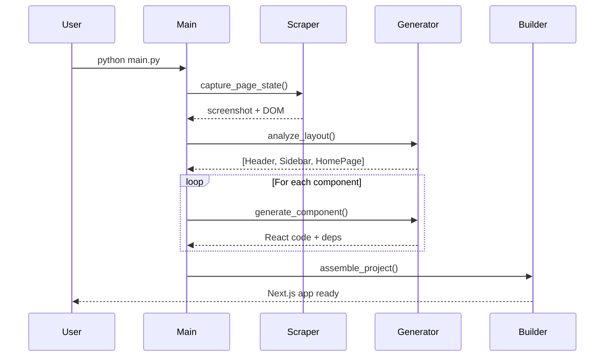
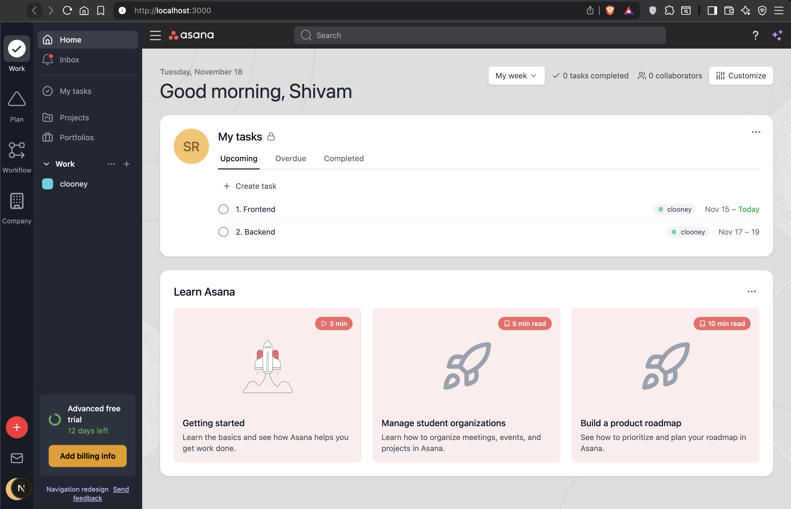

# Clooney: Automated WebApp Replication Agent

> An autonomous agentic system that replicates web applications using multimodal AI

Clooney leverages Google's Gemini LLM to analyze target webpages and iteratively reconstruct them using Next.js and Tailwind CSS. It combines computer vision, DOM analysis, and intelligent code generation to create high-fidelity clones.

---

## Table of Contents

- [Tech Stack](#tech-stack)
- [Architecture](#architecture)
- [Prerequisites](#prerequisites)
- [Installation](#installation)
- [Configuration](#configuration)
- [Usage](#usage)
- [Docker](#docker)
- [Output](#output)
- [Project Structure](#project-structure)

---

## Tech Stack

| Category                     | Technology                  | Purpose                                   |
| ---------------------------- | --------------------------- | ----------------------------------------- |
| **Language**           | Python 3.8+                 | Core orchestration and automation         |
| **AI/ML**              | Google Gemini (Flash & Pro) | Multimodal code generation                |
| **Browser Automation** | Playwright                  | Headless browser control and page capture |
| **Frontend Framework** | Next.js                     | Generated application framework           |
| **Styling**            | Tailwind CSS                | Utility-first styling system              |
| **Testing**            | pytest + pytest-playwright  | Automated visual regression testing       |
| **Image Processing**   | Pillow + pixelmatch         | Screenshot capture and comparison         |
| **HTML Parsing**       | BeautifulSoup4              | DOM structure extraction                  |
| **Environment**        | python-dotenv               | Configuration management                  |

---

## Architecture

### System Flow Diagram



### Agent Lifecycle

| Phase                 | Module                | Input                         | Output                    | Description                                |
| --------------------- | --------------------- | ----------------------------- | ------------------------- | ------------------------------------------ |
| **1. Observe**  | `src/scraper.py`    | Target URL                    | Screenshot + Minified DOM | Captures page state using Playwright       |
| **2. Analyze**  | `src/generator.py`  | Visual + Structural Data      | Component List            | Decomposes page into high-level components |
| **3. Generate** | `src/generator.py`  | Component Names + Context     | React/TSX Code            | Generates production-ready components      |
| **4. Assemble** | `src/builder.py`    | Component Code + Dependencies | Next.js Project           | Builds functional application structure    |
| **5. Evaluate** | `tests/evaluate.py` | Original + Clone              | Similarity Score          | Runs visual regression tests               |

---

## Prerequisites

Ensure the following are installed on your system:

| Requirement       | Version | Purpose              |
| ----------------- | ------- | -------------------- |
| Python            | 3.8+    | Agent runtime        |
| Node.js           | 16+     | Next.js build system |
| pnpm              | Latest  | Package management   |
| Google AI API Key | -       | Gemini model access  |

---

## Installation

Execute the following commands to set up the environment:

```bash
# 1. Install Python dependencies
pip install -r requirements.txt

# 2. Install Playwright browser binaries
playwright install

# 3. Install pnpm (if not already available)
npm install -g pnpm
```

---

## Configuration

### Environment Variables

Create a `.env` file from the provided template:

```bash
cp .env.template .env
```

Configure the following variables:

| Variable           | Description                   | Example                       |
| ------------------ | ----------------------------- | ----------------------------- |
| `GOOGLE_API_KEY` | Your Google AI Studio API key | `AIza...`                   |
| `SITE_URL`       | Target webpage to clone       | `https://app.asana.com/...` |

---

## Usage

### 1. Authentication (Optional)

If the target application requires authentication:

```bash
python auth.py
```

1. Log in to the target application in the launched browser
2. Return to terminal and press **ENTER**
3. Session state saved to `data/session.json`

### 2. Run the Agent

```bash
python main.py
```

### Process Overview



**Execution Steps:**

1. **Observation**: Navigates to target URL, captures full-page screenshot and minified DOM
2. **Analysis**: Decomposes page into high-level components using Gemini Flash
3. **Generation**: Generates production-ready React components using Gemini Pro
4. **Assembly**: Programmatically builds Next.js application with intelligent layout

---

## Docker

Run Clooney inside Docker to avoid installing local dependencies. These are the same commands documented in `DOCKER.md`.

### Docker Compose (Recommended)

```bash
# 1. Copy and edit the env file before starting
cp .env.template .env
# Update GOOGLE_API_KEY and SITE_URL inside .env

# 2. Build and start the stack
docker-compose up --build

# 3. Run any command inside the container
docker-compose exec clooney python main.py

# 4. Tail logs or start detached
docker-compose logs -f
docker-compose up -d

# 5. Stop and clean up
docker-compose down
# Remove volumes/data if needed
docker-compose down --volumes
```

### Direct Docker Commands

```bash
# Build the image
docker build -t clooney-agent .

# Run the container with persistent data
docker run -it --env-file .env \
  -v $(pwd)/data:/app/data \
  -v $(pwd)/builds:/app/builds \
  clooney-agent

# Execute a command inside the running container
docker exec -it <container_id> python main.py

# Stop / restart / remove containers
docker stop <container_id>
docker restart <container_id>
docker rm <container_id>

# Remove an image
docker rmi clooney-agent

# Cleanup helpers
docker container prune
docker image prune -a
docker system prune -a --volumes
```

---

## Output

The generated application is output to `builds/cloned_app`.

### Running the Cloned App

```bash
cd builds/cloned_app
pnpm install
pnpm run dev
```

Access at `http://localhost:3000`

### Evaluation

Run visual regression tests:

```bash
python tests/evaluate.py
```

**Metrics:**

- Visual similarity score (pixelmatch)
- CSS assertion validation
- Component structure verification

---

## Results Showcase

The agent was tested on **Asana** to demonstrate its capabilities. Below is a comparison between the original live website and the fully functional clone generated by Clooney using Next.js and Tailwind CSS.

| Original Asana Page (Dark Mode) | AI-Generated Clone |
|---------------------|-------------------|
|  |  |

*Note: The clone is built autonomously from scratch based on the visual observation.*

---

## Project Structure

```
Clooney/
├── main.py                 # Central orchestrator
├── auth.py                 # Authentication setup
├── src/
│   ├── scraper.py         # Browser automation & capture
│   ├── generator.py       # LLM interface & code generation
│   └── builder.py         # Project assembly & dependency injection
├── tests/
│   ├── evaluate.py        # Evaluation orchestrator
│   └── tests/
│       └── test_visuals.py # Visual regression tests
├── templates/             # Next.js base template
├── data/
│   ├── session.json       # Saved browser session
│   ├── screenshots/       # Captured images
│   └── dom/              # Scraped HTML
└── builds/
    └── cloned_app/       # Generated Next.js application
```

### Module Responsibilities

| Module                | Responsibility                                                            |
| --------------------- | ------------------------------------------------------------------------- |
| `main.py`           | Orchestrates agent lifecycle and manages execution flow                   |
| `src/scraper.py`    | Handles browser automation, navigation, and state capture                 |
| `src/generator.py`  | Interfaces with Gemini API for structure analysis and code generation     |
| `src/builder.py`    | Manages file operations, template instantiation, and dependency injection |
| `tests/evaluate.py` | Provides automated visual regression testing and CSS assertions           |

---

## Key Features

- **Multimodal Analysis**: Combines visual (screenshot) and structural (DOM) data
- **Intelligent Layout**: Smart component placement using heuristic-based assembly
- **Production-Ready Code**: Generates clean, typed React/TypeScript components
- **Automated Testing**: Built-in visual regression and CSS validation
- **Session Persistence**: Handles authenticated applications via saved browser state

---
